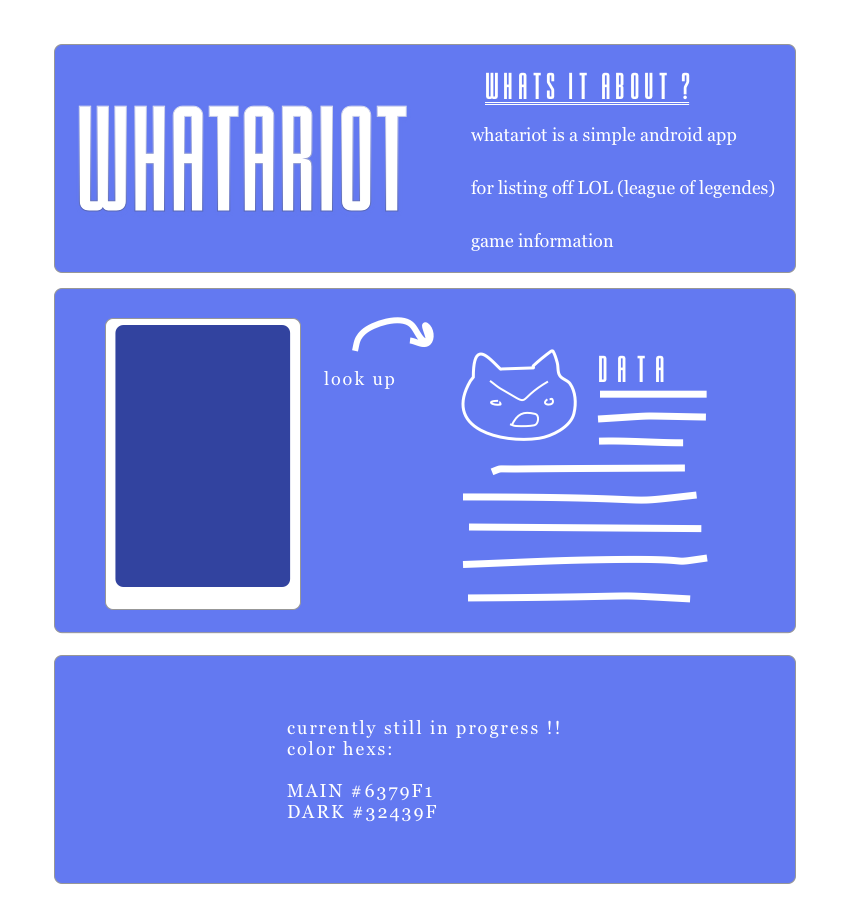

# WhatARiot
✦✦✦✦✦✦✦✦✦✦✦

#### October 23, 2017
#### By Kira Loo

## Description

✦✦✦✦✦✦✦✦✦✦✦

_WhatARiot is a simple app made for accessing different game datas from the healthy and family friendly game league of legends._

_CURRENTLY in `Constants.Java` you have the choice to search by either of two builds: `sorting build` for a full list of champions arranged by attribute or `filtering build` for returning a single champion. notation for accessing a sample of each is below._

## Setup/Installation Requirements
✦✦✦✦✦✦✦✦✦✦✦

* Android Emulator
*
*
*

## Specifications
✦✦✦✦✦✦✦✦✦✦✦

| ✦ Behavior      | ✦ Example Input      | ✦ Example Output       |
| ------------- | ------------- | ------------- |
| ------------- | ------------- | ------------- |
| `Constants` ➡ `Filtering Build` | "Ashe" | Ashe Champion Data: Name, Id & Image URL|
| ------------- | ------------- | ------------- |
| `Constants` ➡ `Sorting Build` | "attackdamage" | All Champions Returned and sorted by attackdamage |
| ------------- | ------------- | ------------- |

## Technologies Used
✦☾✦✦✦✦✦✦✦✦✦✦

*
*
*
*

### License
✦✦✦✦✦✦✦✦✦✦✦✦
Copyright &copy; 2017 _Kira Loo_
