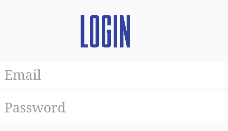

#### By Kira Loo 🍅
`Updated: 11/7/2017`

## Description
WhatARiot is a simple app made for accessing different game datas from the healthy and family friendly game League of Legends. With a quick click you can access API Data for the game and view a list of all champions in chronological order.

With the app you can login-logout, create a authorized new user, view all the champions (chronologically), change the view upon rotation, search from the list, save champions and view your list of saved champions. Key features are a clean UI and comprehensive display of list data.
---------------

---------------
#### BUILD NOTES
>(10/27) App is currently configured for the filtering build! Please note filtering build notation! Only Correct capitalized champion names are currently recognized!!!

>(10/26) All entries/inputs for the filtering build **MUST** be capitalized!!
>
```
ex. 'janna' -> will return nothing
ex. 'Janna' -> will return champion information
```
>
>
>(10/25) in `Constants.Java` you have the choice to search by either of two builds:
>
>`sorting build` for a full list of champions arranged by attribute or
>
>`filtering build` for returning a single champion. notation for accessing a sample of each is below.

```
FUTURE BUILDOUT
- [ ] Animations + Animator
- [ ] Improved UI
- [ ] Tests
```


## Setup/Installation Requirements
✦✦✦✦✦✦✦✦✦✦✦

* Android Emulator
* Android Studio

## Specifications
✦✦✦✦✦✦✦✦✦✦✦

| ✦ Behavior      | ✦ Example Input      | ✦ Example Output       |
| ------------- | ------------- | ------------- |
| Sign-in | user: email@email.com pass: password | Welcome back user! |
| Sign-out | Click -> Sign-out | User is signed out |
| Create new user | name: Kira user: email@email.com pass: password | New user created|
| See all champions | Click -> See all champions | list of all champions  |
| Save Champion | Click -> Save Champion | champion is saved to Firebase & list of saved champions |
| Save Champion list | Click -> Saved Champions | List of all saved champions |
| Reorder List | Drag to reorder | Champions are visually rearranged and reordered on Firebase |
| Delete from List | Swipe to delete | champion is deleted from list and Firebase |
| `Constants` ➡ `Filtering Build` | "Ashe" | Ashe Champion Data: Name, Id & Image URL|
| `Constants` ➡ `Sorting Build` | "attackdamage" | All Champions Returned and sorted by attackdamage |
| ------------- | ------------- | ------------- |
| more 🐣 | coming 🐥 | soon 🐓 |
| ------------- | ------------- | ------------- |

## Technologies Used
✦☾✦✦✦✦✦✦✦✦✦✦

* Android Studio ver(2.3.2)
* Atom

### License
✦✦✦✦✦✦✦✦✦✦✦✦

Copyright &copy; 2017 _Kira Loo_
